# 移动端方案全屏预览功能设计

## 背景

移动端方案生成在"生成结果"区域的卡片受限于 PhoneFrame 的窄手机框，内容展示不完整。用户需要在"生成结果"标题旁添加按钮，进入全屏预览页面，以更宽松的方式查看方案摘要内容。

## 需求

1. 在 ScreenGenerate 中"生成结果"标题右侧添加一个按钮（图标：全屏/展开）
2. 点击后导航到新的 preview screen，展示与"生成结果"相同的 PlanSummary 数据
3. 交互一致（滚动浏览）
4. 顶部栏保留返回按钮，点击回到方案生成页
5. 右上角保留三点导出菜单

## 设计

### 架构

- `ScreenChat.tsx` - `MobileScreen` 增加 `'preview'` 类型
- `ScreenPreview.tsx`（新建）- 新的预览屏组件，渲染方案摘要全部卡片
- `PlanSummaryCards`（提取为共享子组件）- 纯展示组件，ScreenGenerate 和 ScreenPreview 共用
- `MobileWorkbenchPage.tsx` - 将 summary 的获取逻辑从 ScreenGenerate 提到父组件，作为 props 下传给 ScreenGenerate 和 ScreenPreview

### 数据流

```mermaid
flowchart LR
    MW[MobileWorkbenchPage] -->|summary/summaryLoading props| SG[ScreenGenerate]
    MW -->|summary/summaryLoading props| SP[ScreenPreview]
    SG -->|点击按钮 onNavigate&#40;'preview'&#41;| MW -->|screen切换| SP
```

### 组件拆分

PlanSummaryCards 作为纯展示组件，从 ScreenGenerate 中提取，两处复用（ScreenGenerate 现有位置 + ScreenPreview）。

### 路由

preview 不占用外部 Tab Bar（①-⑤），仅内部跳转。

### 返回逻辑

`handleBack` 增加 `preview: 'generate'`。

## in_scope 确认

- 方案预览内容的完整展示
- 手机框内的 screen 切换
- 方案摘要数据传递

## out_scope

- 方案预览内容的编辑
- 外部路由（URL 路径）
